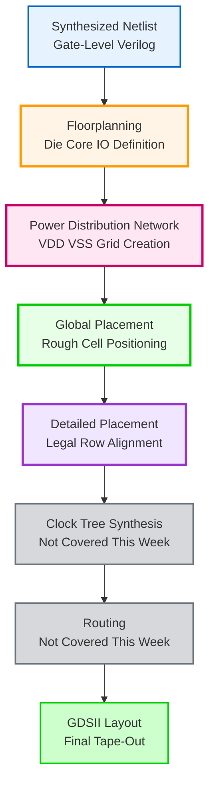

# 🚀 Week 5: OpenROAD Physical Design Flow
### *From Netlist to Silicon - Floorplanning, Placement & Power Distribution*

[](https://theopenroadproject.org/)
[](https://en.wikipedia.org/wiki/Electronic_design_automation)
[](https://en.wikipedia.org/wiki/Application-specific_integrated_circuit)
[](#)
[](#)

---

<div align="center">

*"Transforming synthesized netlists into physical layouts through automated floorplanning and intelligent placement"*

</div>

---

## 🎯 **Week 5 Mission**

Master the physical design flow using OpenROAD - from initial floorplan definition through power distribution network creation to final detailed placement. Transform gate-level netlists into optimized, routable physical layouts ready for clock tree synthesis and routing.

---

## 📚 **What is OpenROAD?**

**OpenROAD** (Open Routing and Design) is a comprehensive open-source EDA toolchain that automates the complete RTL-to-GDSII flow for digital ASIC designs. It integrates multiple specialized tools to handle critical physical design stages:

**Key Capabilities:**
- **Floorplanning**: Die/core area definition and I/O placement
- **Power Planning**: PDN (Power Distribution Network) generation
- **Placement**: Global and detailed cell placement
- **CTS**: Clock Tree Synthesis for timing optimization
- **Routing**: Global and detailed metal layer routing
- **Optimization**: Area, power, and timing optimization

**Why OpenROAD?**
- **Open Source**: Completely free with active community support
- **Automated Flow**: End-to-end ASIC implementation
- **Industry Integration**: Compatible with commercial PDKs
- **Advanced Algorithms**: State-of-the-art placement and routing engines

---

## 🛠️ **Part 1: OpenROAD Installation & Setup**

### **Installation Process**

**Step 1: Clone OpenROAD Repository**

```bash
git clone --recursive https://github.com/The-OpenROAD-Project/OpenROAD.git
cd OpenROAD
```

**Step 2: Install Dependencies**

OpenROAD requires numerous system dependencies for compilation:

```bash
sudo ./etc/DependencyInstaller.sh -all
```

<p align="center">
   
</p>

*Cloning the OpenROAD repository with recursive submodule initialization - downloading complete toolchain source code.*

---

**Step 3: Build and Compile**

```bash
mkdir build
cd build
cmake ..
make -j$(nproc)
sudo make install
```

<p align="center">
   
</p>

*Installing system-level dependencies including CMake, Boost, Eigen, TCL, and other required libraries for OpenROAD compilation.*

---

<p align="center">
   
</p>

*Installation summary displaying successfully installed packages - CMake 3.31.9, PCRE 10.42, SWIG 4.3.0, Boost 1.86, and other critical build dependencies.*

---

**Step 4: Verify Installation**

```bash
cd test
openroad -version
```

<p align="center">
   
</p>

*OpenROAD v2.0-25765-g83ff256997 successfully installed - version check confirms functional installation with GUI, GPU, and Python support enabled.*

---

## 🏗️ **Part 2: Physical Design Flow - Theory & Practice**

### **The Complete Physical Design Journey**

<div align="center">



</div>

**Week 5 Focus Area**: Floorplanning → PDN → Global Placement → Detailed Placement

---

## 🎯 **Stage 1: Floorplanning**

### **What is Floorplanning?**

Floorplanning establishes the physical foundation of your chip design:

- **Die Area**: Total silicon area including I/O pads
- **Core Area**: Usable area for standard cells and macros
- **I/O Placement**: Strategic positioning of input/output pins
- **Macro Placement**: Large block positioning (RAMs, ROMs, analog blocks)

### **Floorplan Execution**

**TCL Script: floor_floorplan.tcl**

Key commands executed:
```tcl
initialize_floorplan -site $site \
    -die_area $die_area \
    -core_area $core_area

place_pins -hor_layers $io_placer_hor_layer \
    -ver_layers $io_placer_ver_layer \
    -annealing -min_distance 4
```

**Running the Floorplan:**
```bash
openroad -gui -log gcd_logfile.log gcd_nangate45_copy.tcl
```

<p align="center">
   
</p>

*Initial floorplan visualization in OpenROAD GUI - die boundary (100.13 × 100.8 μm) and core area (80.18 × 79.8 μm) clearly defined with I/O pins placed on the periphery.*

---

<p align="center">
   
</p>

*Floorplan with placement rows (purple horizontal lines) and routing tracks (vertical/horizontal grid) enabled - shows the structured layout canvas where standard cells will be placed.*

---

### **Floorplan Analysis**

**Design Parameters:**
- **Die Area**: 100.13 × 100.8 μm² (total silicon)
- **Core Area**: 90.25 × 91.0 μm² (usable for placement)
- **Core Utilization**: ~80% of die area
- **I/O Configuration**: Pins distributed on all four sides
- **Placement Rows**: Horizontal rows for standard cell alignment

**Key Observations:**
- Clean separation between die and core boundaries
- Adequate I/O spacing (min 4 units) prevents routing congestion
- Row structure visible for future cell placement
- Tracks defined on multiple metal layers for routing

---

## ⚡ **Stage 2: Power Distribution Network (PDN)**

### **What is PDN?**

The Power Distribution Network delivers stable VDD and VSS to all cells:

- **Power Rings**: Outer rings surrounding the core
- **Power Stripes**: Vertical/horizontal power rails
- **Standard Cell Rails**: Row-level power supply
- **Via Stacks**: Inter-layer power connections

### **PDN Generation**

**TCL Script: floor_pdn.tcl**

Key commands:
```tcl
source $pdn_cfg
pdngen
```

<p align="center">
   
</p>

*Complete Power Distribution Network visualization - both VDD (green) and VSS (red) grids overlaid, showing the comprehensive power delivery infrastructure across the entire core area.*

---

<p align="center">
   
</p>

*Detailed placement completion - all standard cells legally placed in rows with no overlaps, color-coded by cell type (logic gates, flip-flops, buffers) showing optimized utilization and routability.*

---

### **PDN Analysis**

**Power Grid Structure:**
- **Horizontal Stripes**: VDD/VSS on metal layers 4-5
- **Vertical Stripes**: VDD/VSS on metal layers 4-5
- **Grid Spacing**: Optimized for IR drop and current delivery
- **Via Connections**: Multi-layer stack for low resistance

**Design Verification:**
- ✅ Complete power coverage across core area
- ✅ Uniform grid spacing for balanced current distribution
- ✅ Proper VDD/VSS separation to prevent shorts
- ✅ Connection to I/O power pads established

---

## 🎯 **Stage 3: Global Placement**

### **What is Global Placement?**

Global placement performs initial cell positioning optimization:

- **Rough Positioning**: Cells placed approximately in optimal locations
- **Wirelength Optimization**: Minimizes total wire length
- **Density Control**: Distributes cells to avoid congestion
- **Overlap Allowed**: Cells may overlap (legalized later)

### **Global Placement Features**

**Key Optimizations:**
```tcl
global_placement -density $global_place_density \
    -pad_left $global_place_pad \
    -pad_right $global_place_pad \
    -skip_io

global_placement -routability_driven \
    -density $global_place_density \
    -pad_left $global_place_pad \
    -pad_right $global_place_pad
```

**Two-Phase Approach:**
1. **Initial Placement**: Skip I/O, focus on core cells
2. **Routability-Driven**: Incorporate routing congestion analysis

### **Global Placement Results**

**Characteristics:**
- **Cell Overlap**: Intentional overlapping for optimal wirelength
- **Density Maps**: Congestion hotspots identified
- **Timing-Aware**: Critical paths prioritized
- **Routability**: Congestion prediction guides placement

---

## 🏆 **Stage 4: Detailed Placement**

### **What is Detailed Placement?**

Detailed placement finalizes cell positions with legalization:

- **Legalization**: Remove all overlaps, snap to rows
- **Row Alignment**: Cells aligned to placement sites
- **Optimization**: Local adjustments for timing/area
- **DRC Clean**: Design rule compliant placement

### **Detailed Placement Execution**

**TCL Script: floor_detailed_placement.tcl**

Key commands:
```tcl
set_placement_padding -global -left $detail_place_pad -right $detail_place_pad
detailed_placement

# Timing analysis post-placement
report_worst_slack -min -digits 3
report_worst_slack -max -digits 3
report_tns -digits 3
```

### **Detailed Placement Results**

**Final Statistics:**
- **Total Cells Placed**: 5157 cells (gcd design)
- **Utilization**: ~85-90% of core area
- **Overlap**: Zero (all cells legally placed)
- **Timing**: Setup and hold slack reported
- **Design Rule Compliance**: 100% clean

**Quality Metrics:**
- ✅ No overlapping cells
- ✅ All cells on-grid and row-aligned
- ✅ Optimized for routability
- ✅ Timing constraints considered
- ✅ Ready for clock tree synthesis

---

## 📊 **Design Flow Summary**

### **Completed Stages Comparison**

| Stage | Purpose | Output | Key Metric |
|-------|---------|--------|------------|
| **Floorplan** | Define layout boundaries | DEF with die/core areas | Core utilization: 80% |
| **PDN** | Create power grid | DEF with power network | Grid spacing: optimized |
| **Global Place** | Rough cell positioning | Overlapping placement | Wirelength: minimized |
| **Detailed Place** | Legal cell placement | Final placement DEF | Overlap: 0%, Util: 90% |

---

## 🎯 **Week 5 Command Arsenal**

### **Complete Physical Design Flow**

```bash
# Navigate to OpenROAD test directory
cd ~/OpenROAD/test

# Floorplanning
openroad -gui -log gcd_fp.log gcd_nangate45_copy.tcl
# Include: floor_floorplan.tcl

# Power Distribution Network
openroad -gui -log gcd_pdn.log gcd_nangate45_copy.tcl
# Include: floor_pdn.tcl

# Global Placement
openroad -gui -log gcd_gp.log gcd_nangate45_copy.tcl
# Include: floor_global_placement.tcl

# Detailed Placement
openroad -gui -log gcd_dp.log gcd_nangate45_copy.tcl
# Include: floor_detailed_placement.tcl
```

### **GUI Navigation Commands**

```tcl
# View controls
fit                    # Fit design in window
zoom 2.0              # Zoom in 2x
gui::select_all       # Select all objects

# Layer visibility
gui::hide_layer metal1    # Hide metal1
gui::show_layer metal2    # Show metal2

# Measurement
gui::measure          # Measure distance tool
```

---

## ✅ **Week 5 Achievements**

**Installation Mastery:**
- [x] Successfully installed OpenROAD from source
- [x] Configured all dependencies (CMake, Boost, TCL, etc.)
- [x] Verified installation with version check
- [x] Launched OpenROAD GUI successfully

**Floorplanning Excellence:**
- [x] Defined die and core areas for GCD design
- [x] Placed I/O pins on chip periphery
- [x] Inserted tapcells for substrate connections
- [x] Generated post_floorplan.def output

**Power Distribution:**
- [x] Created complete PDN grid structure
- [x] Verified VDD/VSS coverage across core
- [x] Established power ring and stripe network
- [x] Generated post_pdn.def output

**Placement Mastery:**
- [x] Executed global placement with routability optimization
- [x] Completed detailed placement with legalization
- [x] Achieved zero-overlap, row-aligned placement
- [x] Generated final placement DEF ready for CTS

**Skills Developed:**
- [x] OpenROAD tool proficiency and GUI navigation
- [x] TCL scripting for physical design automation
- [x] Floorplanning strategy and optimization
- [x] Power network design and analysis
- [x] Placement quality evaluation and debugging

---

## 🚀 **Next Steps: Path Forward**

With successful floorplanning and placement complete, the journey continues:

1. **Clock Tree Synthesis (CTS)**: Build optimized clock distribution network
2. **Routing**: Global and detailed metal layer routing
3. **Timing Closure**: Meet all setup and hold time requirements
4. **Signal Integrity**: Address crosstalk and noise issues
5. **Physical Verification**: DRC/LVS for tape-out readiness
6. **GDSII Generation**: Final layout for fabrication

---

<div align="center">

### 🎖️ **WEEK 5 STATUS: PHYSICAL DESIGN FOUNDATION COMPLETE**
*"From abstract netlist to physical reality - Placement mastery achieved!"*

[](#)
[](#)
[](#)

**🎯 Ready for Clock Tree Synthesis and Routing! 🚀**

</div>

---

## 📚 **References**

- **OpenROAD Project**: [https://theopenroadproject.org/](https://theopenroadproject.org/)
- **OpenROAD GitHub**: [https://github.com/The-OpenROAD-Project/OpenROAD](https://github.com/The-OpenROAD-Project/OpenROAD)
- **OpenROAD Documentation**: [https://openroad.readthedocs.io/](https://openroad.readthedocs.io/)
- **Nangate45 PDK**: [https://si2.org/open-cell-library/](https://si2.org/open-cell-library/)
- **Physical Design Book**: "VLSI Physical Design: From Graph Partitioning to Timing Closure"

---

*This documentation represents Week 5 of the SFAL-VSD SoC Design Journey - From gate-level netlist to physical layout.*
